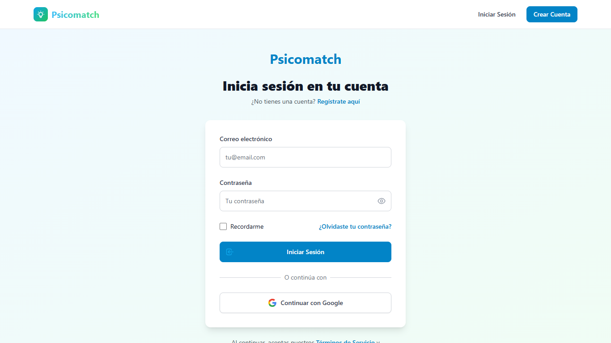
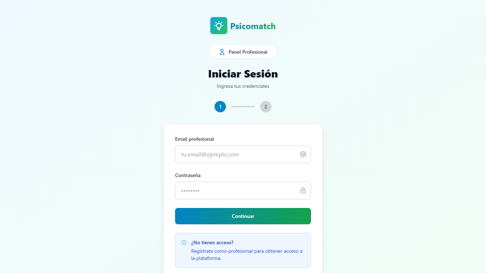
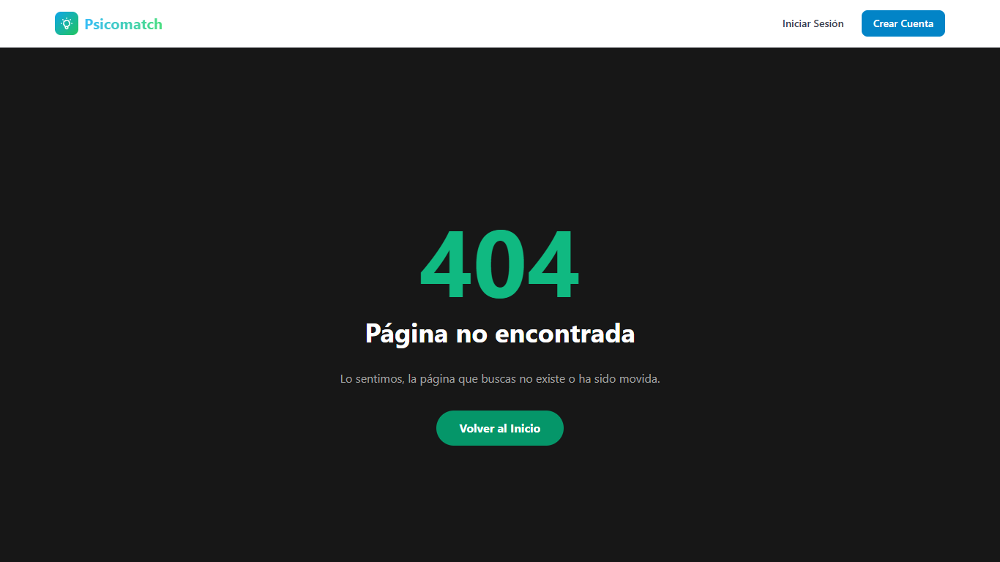
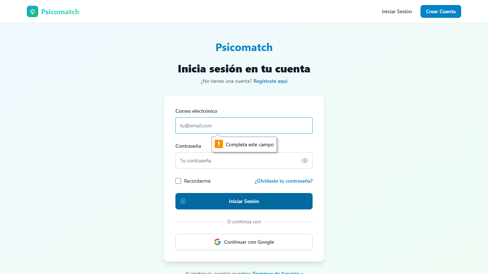

# 📊 Reporte Ejecutivo de Calidad y Rendimiento - PsicoMatch
**Fecha de Emisión:** 8/12/2025, 12:34:33 a. m.
**Entorno de Pruebas:** Localhost (Desarrollo)

## 1. Resumen Ejecutivo
Este documento detalla los resultados de la auditoría automatizada realizada a la plataforma PsicoMatch. El objetivo es certificar la estabilidad, seguridad y eficiencia de los flujos críticos de usuario.

### Glosario de Métricas
- **Tiempo de Carga (Load Time):** Tiempo transcurrido desde la solicitud inicial hasta que la página es completamente interactiva (Network Idle).
- **Network Idle:** Estado en el que no hay conexiones de red activas (todas las imágenes, scripts y APIs han cargado).

## 2. Resultados de Pruebas Funcionales y de Seguridad
Esta sección valida que las características clave funcionen según lo previsto y que los mecanismos de seguridad estén activos.

| ID | Categoría | Prueba | Estado | Descripción Técnica y Resultado |
|----|-----------|--------|--------|---------------------------------|
| 1 | **Rendimiento** | Home Page Load | ✅ PASS | Página de inicio cargada correctamente |
| 2 | **Rendimiento** | Login Page Load | ✅ PASS | Formulario de login detectado en /login |
| 3 | **Seguridad** | Protected Route Guard | ✅ PASS | Redirigido correctamente desde /dashboard a http://localhost:3000/login |
| 4 | **General** | User Registration Page | ✅ PASS | Formulario de registro cargado correctamente |
| 5 | **General** | Professional Login Page | ✅ PASS | Formulario de login profesional cargado correctamente |
| 6 | **Seguridad** | Security: Admin Route | ✅ PASS | Acceso denegado a /admin (Redirigido) |
| 7 | **Seguridad** | Security: Professional Dashboard | ✅ PASS | Acceso denegado a /professional-dashboard (Redirigido) |
| 8 | **Funcionalidad** | Functionality: 404 Handling | ✅ PASS | Componente 404 personalizado mostrado correctamente |
| 9 | **Funcionalidad** | Functionality: Login Validation | ✅ PASS | Inputs tienen atributo required HTML5 |
| 10 | **Diseño / UI** | Responsive: Mobile View | ℹ️ INFO | Captura móvil generada. Verificar visualmente. |

## 3. Auditoría de Rendimiento (Performance)
El rendimiento se evalúa basándose en la experiencia de usuario. Tiempos menores aseguran mayor retención.

### ⚡ Tiempos de Carga (Page Load)
*Criterio de Excelencia: < 1500ms*

| Página Auditada | T. Obtenido | Calificación | Impacto en Usuario |
|-----------------|-------------|--------------|--------------------|
| **Inicio (Landing)** | **823.30 ms** | 🚀 Excelente | Experiencia instantánea. Percepción fluida. |
| **Registro** | **328.07 ms** | 🚀 Excelente | Experiencia instantánea. Percepción fluida. |
| **Portal Profesional** | **86.04 ms** | 🚀 Excelente | Experiencia instantánea. Percepción fluida. |

> **Nota Técnica:** Los tiempos medidos en entorno local (Dev) suelen ser superiores a Producción debido a la falta de minificación y optimización del servidor de desarrollo. Se espera una mejora del 30-50% en el build final.

## 4. Evidencias Visuales
Capturas de pantalla tomadas automáticamente al finalizar la carga de cada ruta para certificar la integridad visual.

### Seguridad y Control de Acceso
| Admin Route (Acceso Denegado) | Dashboard Prof (Acceso Denegado) |
|-------------------------------|----------------------------------|
|  |  |
| *El sistema redirige correctamente.* | *Protección de ruta activa.* |

### Experiencia de Usuario (Frontend)
| Página 404 (Manejo de Error) | Validación de Formularios |
|------------------------------|---------------------------|
|  |  |
| *Diseño personalizado para enlaces rotos.* | *Feedback visual nativo HTML5.* |

### Adaptabilidad Móvil

 
*Vista renderizada en emulación de iPhone SE. Se verifica que no hay desbordamientos horizontales.*

---
*Certificado generado automáticamente por PsicoMatch QA*
